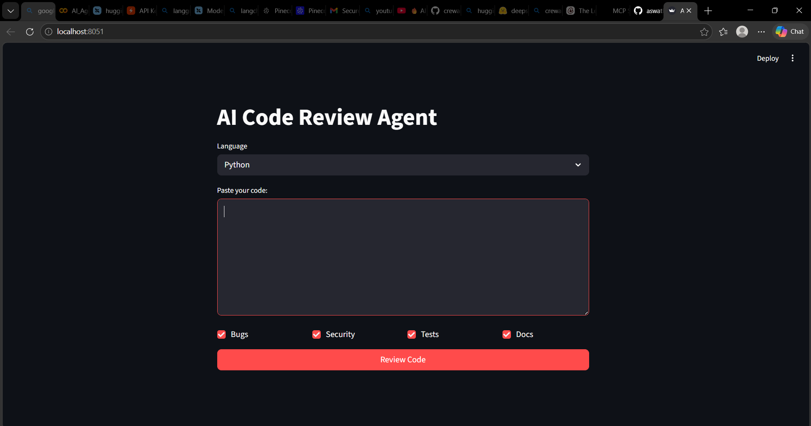
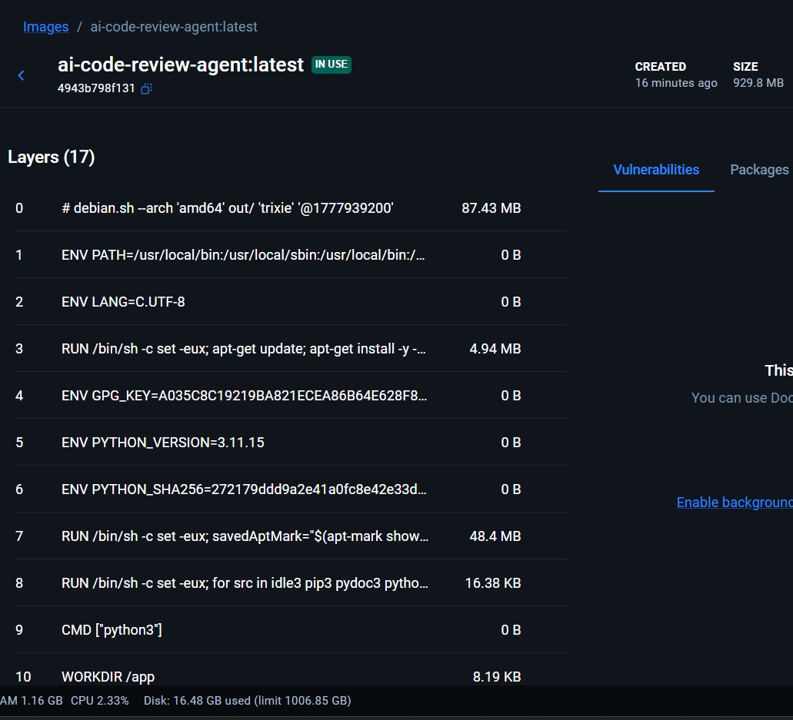
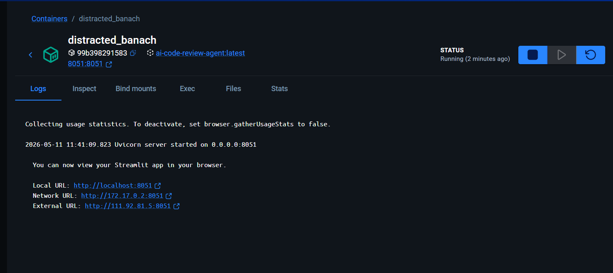

### 1. Change into current directory

```bash
cd AI-Code-Review-Agent
```

### 2. Create Virtual Environment

```bash
python -m venv .venv
.venv\Scripts\activate        # Windows
source .venv/bin/activate     # Mac/Linux
```

### 3. Install Dependencies

```bash
pip install -r requirements.txt
```

### 4. Set Up Environment


# Create .env file
echo GROQ_API_KEY=gsk_your_key_here > .env


### 5. Run the App

```bash
streamlit run src/app.py
```

Open browser at http://localhost:8501


## 💻 Usage

### Web Interface

1. Open http://localhost:8501
1. Select programming language
1. Paste your code
1. Select tools (Bugs / Security / Tests / Docs)
1. Click *Review Code*
1. View results in tabs — download as .md

# UI




## 🐳 Docker Deployment

### Build Image

```bash
docker build -t ai-code-review-agent .
```


### Run Container

```bash
docker run -p 8501:8501 --env-file .env ai-code-review-agent
```


### Useful Docker Commands

```bash
# List images
docker images

# Stop container
docker stop <container_id>

# Remove image
docker rmi ai-code-review-agent

# Remove all unused images
docker image prune -a

```


